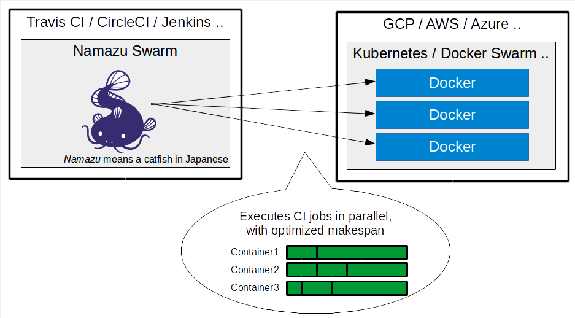
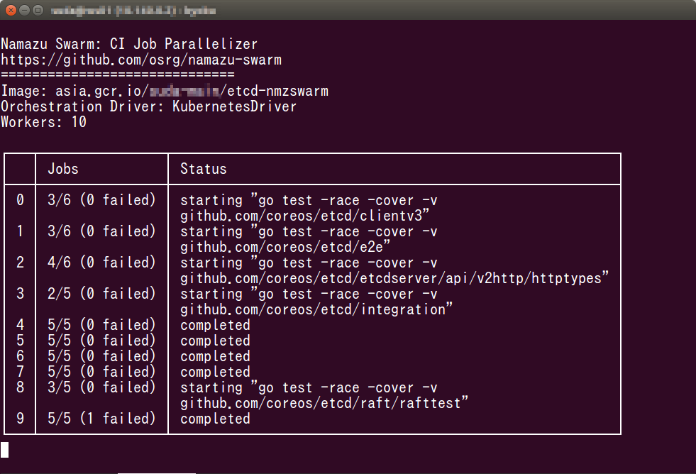

# Namazu Swarm: CI Job Parallelizer built on Docker and Kubernetes

Namazu Swarm executes multiple CI jobs in parallel across a Docker cluster

Namazu Swarm is a part of [Namazu](https://github.com/osrg/namazu), a programmable fuzzy scheduler for testing distributed systems.
[Namazu (鯰) means a catfish :fish: in Japanese](https://en.wiktionary.org/wiki/%E9%AF%B0).

Blog: [http://osrg.github.io/namazu/](http://osrg.github.io/namazu/)

Twitter: [@NamazuFuzzTest](https://twitter.com/NamazuFuzzTest)

## Motivation

- Faster test execution
- Reproduction of flaky test by repeating the test many times simultaneously
- `git bisect`

Namazu Swarm is heavily inspired by Cloudera's [dist_test](https://github.com/cloudera/dist_test), which has been [used](http://dist-test.cloudera.org:8080/) in Apache Kudu's community.
Compared to dist_test, Namazu Swarm is made simple: it utilizes the Docker image format for isolating jobs.

Namazu Swarm is also similar to Square's [XCKnife](https://github.com/square/xcknife).
While XCKnife is designed solely for XCTest, Namazu Swarm is applicable to any testing framework.

## Quick Start
### Installation

You need Python 3.5 or later to run Namazu Swarm.

    $ python3 setup.py install

The PyPI package will be available soon.

Older Python versions (3.2, 3.3, and 3.4) and [Pyinstaller](http://www.pyinstaller.org/) binary can be supported upon request.

### Parallelizing on a non-distributed Docker host

    $ docker build -t etcd-nmzswarm ./example/etcd
    $ nmzswarm run --parallel 10 --logs /tmp/logs etcd-nmzswarm

### Parallelizing on a [Google Container Engine](https://cloud.google.com/container-engine/) (Kubernetes)

Build the Docker image:

    $ docker build -t etcd-nmzswarm ./example/etcd

Push the docker image to Google Container Registry:

    $ docker tag etcd-nmzswarm gcr.io/<PROJECT_ID>/etcd-nmzswarm:foobar && \
	  gcloud docker push gcr.io/<PROJECT_ID>/etcd-nmzswarm:foobar

Load the Google Container Engine credential:

    $ gcloud container clusters get-credentials <CLUSTER> \
      --zone <ZONE> --project <PROJECT_ID>

Make sure `kubectl` works:

    $ kubectl get nodes

Run the jobs:

    $ nmzswarm --driver=k8s run --parallel 10 --logs /tmp/logs gcr.io/<PROJECT_ID>/etcd-nmzswarm:foobar

## NamazuSwarmfile

Namazu Swarm requires a special script named `NamazuSwarmfile` with in the root directory of the container image.
Please refer to [docs/NamazuSwarmfile.md](docs/NamazuSwarmfile.md).

Examples:

 - [etcd](example/etcd)

## Implemented and planned features

**Orchestrator**:

 - [X] Non-distributed plain Docker (default)
 - [X] Kubernetes (experimental)
 - [X] "Old" Docker Swarm (it should work but not tested)
 - [ ] "New" Docker Swarm

**CI**:

 - [X] Any! (that supports storing credentials for accessing the orchestrator. Example: [TravisCI](https://docs.travis-ci.com/user/encryption-keys/))

**Target program**:

 - [X] Any! (you just need to supply a simple [`NamazuSwarmfile`](docs/NamazuSwarmfile.md) script)

**Job progress UI**:

 - [X] Text
 - [ ] curses (WIP)
 - [ ] static HTML

**Report**:

 - [ ] Static HTML

**Scheduling**

 - [ ] [Makespan](https://en.wikipedia.org/wiki/Makespan) optimization using statically estimated cost values
 - [ ] Makespan optimization using the past job execution history on a DB, such as Google Cloud SQL or Amazon RDS (DB needs to be supported by [SQLAlchemy](http://docs.sqlalchemy.org/en/latest/core/engines.html#supported-databases))

## How to Contribute
We welcome your contribution to Namazu Swarm.
Please feel free to send your pull requests on github!

    $ git clone https://github.com/osrg/namazu-swarm.git
    $ cd namazu-swarm
    $ git checkout -b your-branch
    $ your-editor foo.py
    $ ./.hack.lint.sh
    $ git commit -a -s

## Copyright
Copyright (C) 2016 [Nippon Telegraph and Telephone Corporation](http://www.ntt.co.jp/index_e.html).

Released under [Apache License 2.0](LICENSE.txt).
